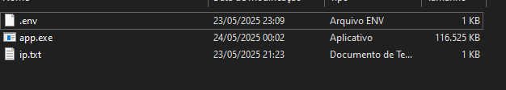

## Development
To start the development server run:
```bash
bun run dev
```

Open http://${your_ip}:3000/ with your browser to see the result.

---

### 📝 Dica extra

Estrutura que tem que ser para o app rodar:



